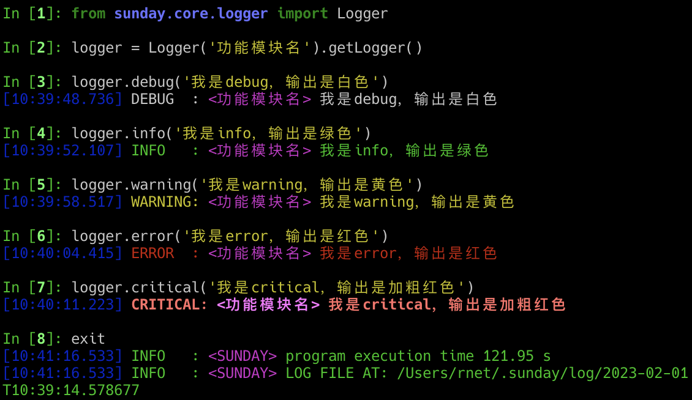

# logger

超级好用的日志工具

---

## API说明

::: sunday.core.Logger
    :docstring:
    :members: getLogger

NOTE: **提示**
在`$SUNDAY_ROOT/config.ini`文件中可以配置日志的显示格式与显示级别，优先级低于Logger实例化传入，参见[配置]内容.

PYSunday的日志模块使用很简单，实例化后的日志对象提供6种等级的日志打印方式：debug、info、warning、error、critical

## 示例

如下示例使用的显示格式为：`%%(blue)s[%%(asctime)s.%%(msecs)-3d] %%(log_color)s%%(levelname)-7s: %%(purple)s<%%(name)s> %%(log_color)s%%(message)s`

```python
from sunday.core import Logger

logger = Logger('功能模块名').getLogger()
logger.debug('我是debug，输出是白色')
logger.info('我是info，输出是绿色')
logger.warning('我是warning，输出是黄色')
logger.error('我是error，输出是红色')
logger.critical('我是critical，输出是加粗红色')
```



程序执行后会生成日志文件，可通过查看日志文件检查程序执行是否符合程序执行预期：

```bash
less /Users/rnet/.sunday/log/2023-02-01T20:39:14.578677
```


## setLogLevel方法

该方法可以修改所有已经存在的Logger实例的日志打印等级，如果是命令工具可以直接通过命令入参的`--loglevel`控制，不建议独立使用

::: sunday.core.setLogLevel
    :docstring:

[配置]: setting.md
